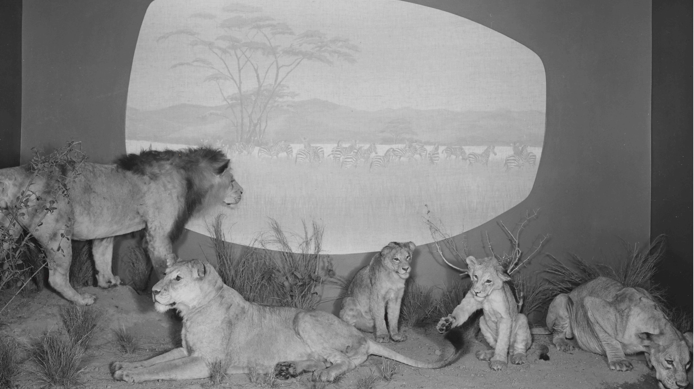
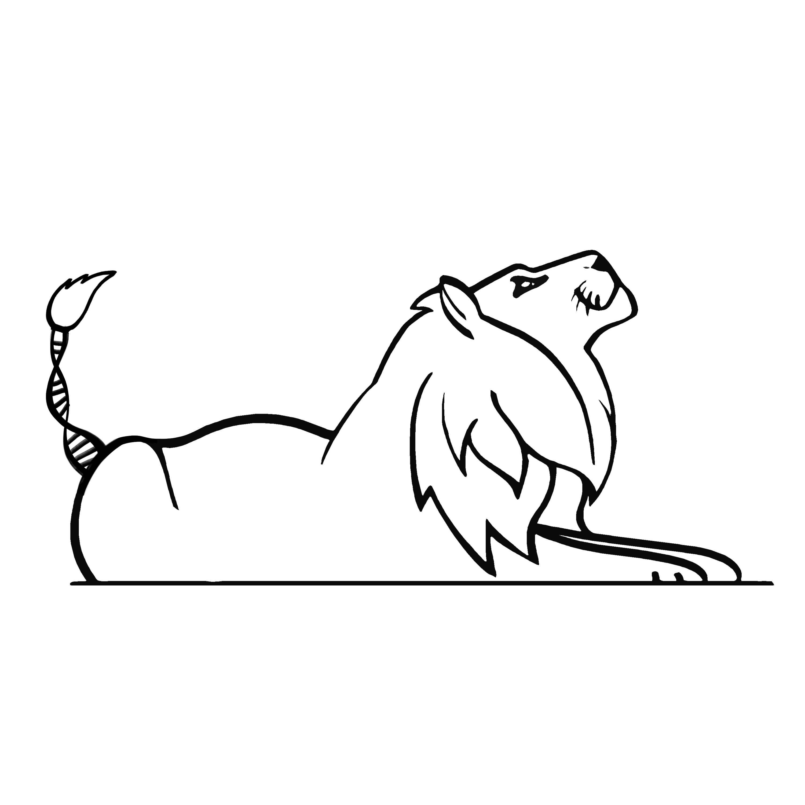

# Museum Specimens Processing Pipeline  
  

Michael G. Campana, 2023-2024  
Smithsonian's National Zoo & Conservation Biology Institute  

This Nextflow [1] pipeline automates the alignment of Illumina sequencing reads from historic and ancient DNA specimens against a reference genome. Reads are trimmed and merged with AdapterRemoval v2 [2] and aligned with BWA-ALN [3] following [4]. Alignments are processed using SAMtools [5-6] and the Genome Analysis Toolkit [7]. In addition to SAMtools, duplicates can be marked using Picard [8] or Sambamba [9]. DNA damage is profiled using DamageProfiler [10] and read ends are trimmed using BamUtil [11]. Optionally, sexing is performed using Rx [12-13] or Ymer profiling. The pipeline can also automate BLAST [14] analysis of unaligned reads. The pipeline also annotates low-mappability regions in the reference genome using GenMap [15] and filterGM from RatesTools [16] for downstream filtering.  

## Citation  
  
Please cite: Armstrong, E.E., Curry, C., Solari, K.A., Morgan, S.M., Patterson, B.D., Parker, L.D., McInerney, N., Helgen, K.M., Packer, C., Petrov, D.A., Hadly, E.A., Maldonado, J.E., Fleischer, R.C., Campana, M.G. In prep. East African lion genetic structure reflects 20th century human impacts.  

## License  
This software is licensed under the Smithsonian Institution [terms of use](https://www.si.edu/termsofuse).  

## Installation  
After installing [Nextflow](https://www.nextflow.io/) and [Mamba](https://mamba.readthedocs.io/en/latest/installation/mamba-installation.html), download the pipeline using:  
`nextflow pull campanam/MuseumSpecimens`  

## Configuring the Pipeline  
The `nextflow.config` file included with this repository contains a `standard` profile for running the pipeline locally. See the Nextflow documentation for assistance in generating a configuration profile for your computing system. The parameters you will need to provide to execute the pipeline are listed in the `params` block. These are:  

`refseq`: Path to the genome reference sequence  
`outdir`: Path to the output directory  
`gm_tmpdir`: Path to the temporary directory for GenMap indexing  
`gm_opts`: String of options for GenMap mapping (except threading)  
`pelibraries`: Path to the CSV detailing paired-end sequencing libraries (See below)  
`selibraries`: Path to the CSV detailing single-end sequencing libraries (See below)  
`readDir`: Path to the folder containing the FASTQ reads  
`picard_java`: String of Java options for Picard  
`gatk_java`: String of Java options for GATK  
`java11_options`: String of Java options for Java 11 (needed for DamageProfiler)  
`markDuplicates`: Choice of "picard", "samtools" or "sambamba" for markDuplicates  
`aDNA_trimmed_bases`: Number of bases to trim from 5' and 3' termini to account for deamination damage  
`rx`: Run sexing using Rx statistic (True or False)  
`rx_script`: Path to customized Mittnik et al. 2016 Rx script  
`kmerSex`: Run sexing using Ymers (True or False)  
`kmers`: Path to list of Ymers  
`sry`: Coordinates of SRY in reference genome if sexing using Ymers  
`blast`: Run BLAST analysis on unaligned reads (True or False)  
`blastdb`: Path to BLAST database if using blast analysis  

## Sample CSV Files  
The pipeline expects two CSV files listing sample and individual library names, read files, and adapter sequences. Should your data only include one type of data (paired-end or single-end), please provide a headered CSV file for the missing data type and enter no data rows.  

For paired-end reads, the CSV file requires the following header:  
`Sample,Library,Read1,Read2,Adapter1,Adapter2`  

For single-end reads, the CSV requires the following header:  
`Sample,Library,Read1,Adapter1,Adapter2`  

`Sample` is the name of the sample, while `Library` is in the individual library identification (in case a sample was sequenced more than once). `Read1` and `Read2` give the forward and reverse read file names. `Adapter1` and `Adapter2` are the complete library adapter sequences.  

## Executing the Pipeline  
Execute the pipeline using the following command:  
`nextflow run campanam/MuseumSpecimens -r main -c <config_file.config> -profile standard`  

## References  
1. Di Tommaso, P., Chatzou, M., Floden, E.W., Prieto Barja, P., Palumbo, E., Notredame, C. (2017) Nextflow enables reproducible computational workflows. *Nat Biotechnol*, __35__, 316–319. DOI: [10.1038/nbt.3820](https://www.nature.com/articles/nbt.3820).  
2. Schubert, M., Lindgreen, S., Orlando, L. (2016) AdapterRemoval v2: rapid adapter trimming, identification, and read merging. *BMC Research Notes*, __9__, 88. DOI: [10.1186/s13104-016-1900-2](https://doi.org/10.1186/s13104-016-1900-2).  
3. Li, H., Durbin, R. (2009) Fast and accurate short read alignment with Burrows-Wheeler transform. *Bioinformatics*, __25__, 1754-1760. DOI: [10.1093/bioinformatics/btp324](https://academic.oup.com/bioinformatics/article/25/14/1754/225615).  
4. Schubert, M., Ginolhac, A., Lindgreen, S., Thompson, J.F., AL-Rasheid, K.A.S., Willerslev, E., Krogh, A., Orlando, L. (2012) Improving ancient DNA read mapping against modern reference genomes. *BMC Genomics*, __13__, 178. DOI: [10.1186/1471-2164-13-178](https://doi.org/10.1186/1471-2164-13-178).  
5. Li, H., Handsaker, B., Wysoker, A., Fennell, T., Ruan, J., Homer, N., Marth, G., Abecasis, G., Durbin, R., 1000 Genome Project Data Processing Subgroup (2009) The Sequence Alignment/Map format and SAMtools. *Bioinformatics*, __25__, 2078-2079. DOI: [10.1093/bioinformatics/btp352](https://academic.oup.com/bioinformatics/article/25/16/2078/204688).  
6. Danecek, P., Bonfield, J.K., Liddle, J., Marshall, J., Ohan, V., Pollard, M.O., Whitwham, A., Keane, T., McCarthy, S.A., Davies, R.M., Li, H. (2021) Twelves years of SAMtools and BCFtools. *GigaScience*, __10__, giab008. DOI: [10.1093/gigascience/giab008](https://academic.oup.com/gigascience/article/10/2/giab008/6137722).  
7. McKenna, A., Hanna, M., Banks, E., Sivachenko, A., Cibulskis, K., Kernytsky, A., Garimella, K., Altshuler, D., Gabriel, S., Daly, M., DePristo, M.A. (2010) The Genome Analysis Toolkit: a MapReduce framework for analyzing next-generation DNA sequencing data. *Genome Res*, __20__, 1297-1303. DOI: [10.1101/gr.107524.110](https://genome.cshlp.org/content/20/9/1297.abstract).
8. Broad Institute (2023). Picard v. 3.1.0 (https://broadinstitute.github.io/picard/).  
9. Tarasov, A., Vilella, A.J., Cuppen, E., Nijman, I.J., Prins, P. (2015) Sambamba: fast processing of NGS alignment formats. *Bioinformatics*, __31__, 2032–2034. DOI: [10.1093/bioinformatics/btv098](https://academic.oup.com/bioinformatics/article/31/12/2032/214758).  
10. Neukamm, J., Peltzer, A., Nieselt, K. (2021) DamageProfiler: fast damage pattern calculation for ancient DNA. *Bioinformatics*, __37__, 3652–3653. DOI: [10.1093/bioinformatics/btab190](https://doi.org/10.1093/bioinformatics/btab190).  
11. Jun, G., Wing, M.K., Abecasis, G.R., Kang, H.M. (2015) An efficient and scalable analysis framework for variant extraction and refinement from population-scale DNA sequence data. *Genome Res*, __25__, 918–925. DOI: [10.1101/gr.176552.114](https://doi.org/10.1101/gr.176552.114).  
12. Mittnik, A., Wang, C.-C., Svoboda, J., Krause, J. (2016) A molecular approach to the sexing of the triple burial at the Upper Paleolithic site of Dolní Věstonice. *Plos One*, __11__, e0163019. DOI: [10.1371/journal.pone.0163019](https://doi.org/10.1371/journal.pone.0163019).  
13. de Flamingh, A., Coutu, A., Roca, A.L., Malhi, R.S. (2020) Accurate sex identification of ancient elephant and other animal remains using low-coverage DNA shotgun sequencing data. *G3: Genes Genomes Genet*, __10__, 1427-1432. DOI: [10.1534/g3.119.400833](https://doi.org/10.1534/g3.119.400833).  
14. Camacho, C., Coulourism G., Avagyan, V., Ma, N., Papadopoulos, J., Bealer, K., Madden, T.L. (2009) BLAST+: architecture and applications. *BMC Bioinformatics*, __10__, 421. DOI: [10.1186/1471-2105-10-421](https://doi.org/10.1186/1471-2105-10-421).
15. Pockrandt, C., Alzamel, M., Iliopoulos, C.S., Reinert, K. (2020) GenMap: ultra-fast computation of genome mappability. *Bioinformatics*, __36__, 3687–3692, DOI: [10.1093/bioinformatics/btaa222](https://academic.oup.com/bioinformatics/article/36/12/3687/5815974).
16. Armstrong, E.E., Campana, M.G. 2023. RatesTools: a Nextflow pipeline for detecting *de novo* germline mutations in pedigree sequence data. *Bioinformatics*, __39__, btac784. DOI: [10.1093/bioinformatics/btac784](https://doi.org/10.1093/bioinformatics/btac784).  

## Image Credits:  
Roosevelt Lion Photograph: Smithsonian Institution. 1959. Smithsonian Institution Archives, Record Unit 95, Box 44A, Folder 04, Image No. SIA_000095_B44A_F04_001. https://www.si.edu/object/world-mammals-exhibition-hall-museum-natural-history-lion-habitat-group:siris_arc_402161.  
Lion Genomics Cartoon: T.W. Campana, 2024. Used with permission of the illustrator.  
